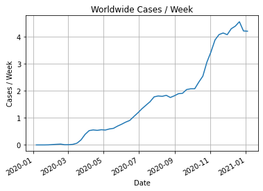
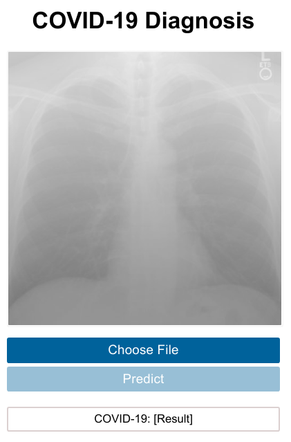

# Convolutional Neural Networks for the detection of COVID-19

> Disclaimer: This is not a scientific paper. It is a university assignment. Date: 12/01/2021

**Authors**
- [Panakakis Stavros](https://github.com/Stavrospanakakis)
- [Tsivoula Sophia](https://github.com/sophia-ts)

## Assignment
You can view the full pdf [here](https://github.com/Stavrospanakakis/covid19-NN-study/blob/main/exports/main.pdf).

COVID-19 is a newly invented virus that evolved into a pandemic. This virus affects mostly the respiratory system and could cause mild symptoms as fatigue, cough and in some cases even death. There are more than 90 million cases worldwide and the death rate is relatively low at approximately 2\%. The virus up to this day, has affected millions of citizens in the entire planet. On a social level many people changed their lifestyle in order to prevent spreading the virus and protect themselves. Also, many people had to lose their jobs or transfer them on the web. Central banks have reduced policy interest rates and announced additional financing facilities in order to help both individuals and businesses to recover. Many computer scientists and physicians  created CNNs (Convolutional Neural Networks) in order to be able to detect from a chest X-ray if the patients suffer from COVID-19 or not and reduce the time that doctors have to spend with their patients. In order to create the models, they need large amounts of chest X-rays from COVID-19 patients and non-COVID-19 patients to achieve high accuracy and help physicians diagnose patients fast and securely. The most accurate network was ResNet-101 with 99.51% accuracy. After the review of the papers two different versions of COVnet-101 were developed with 97.4\% and 91.5\% accuracy correspondingly.  


## Presentation
You can view the presentation [here](https://github.com/Stavrospanakakis/covid-19-diagnosis/blob/main/exports/presentation.pdf).


## Notebooks
The notebooks which we used for the training of the networks and to plot the cases are [here](https://github.com/Stavrospanakakis/covid19-diagnosis/tree/main/notebooks).



## Web Application
Web application is created with Flask and Reactjs. If you want to run it on your system please follow the instructions below. 



### Run application
In order to run the application, "model.h5" is required. If you want to run it in your system please open an issue so I can send it to you or train the model by yourself with the available notebooks and save the file. 

#### Development
```
# Clone the repository
$ git clone https://github.com/Stavrospanakakis/covid-19-diagnosis.git

# Go to the build folder
$ cd covid-19-diagnosis/src/build/docker

# Run docker
$ docker-compose up --build
```

#### Production

- Set your custom REACT_APP_INTERNAL_IP and REACT_APP_INTERNAL_PORT env variables.

- Build the Docker Images and upload them to your Docker Hub Personal Account

- Change the name of the images with yours on ```docker-compose.yml``` file

Then run:

```
# Install docker and get the docker-compose files
$ wget https://raw.githubusercontent.com/Stavrospanakakis/covid-19-diagnosis/main/src/scripts/install.sh
$ chmod +x ./install.sh
$ ./install.sh

# Initialize docker swarm
$ docker swarm init 

# Deploy with compose files
$ docker stack deploy -c docker-compose.yml -c docker-compose.prod.yml
```


